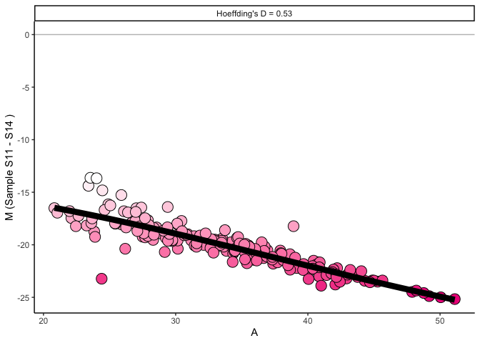

sweetD: Hoeffding’s D statistic as a Summary Statistic for MA plots
================


Amber Barton


## Background

In transcriptomic data, MA plots are commonly used to visualise the
relationship between M (log fold difference between two samples) and A
(he average abundance (intensity or counts) of a gene). Each dot
represents a gene or other feature. MA plots are often used to
illustrate differential expression, as the further a gene is away from
an “M” of zero, the more different it is between samples or groups. MA
plots also a good way to check for batch effects, or whether your
normalisation has been successful.

Since we only expect a minority of genes to be differentially expressed,
MA plots should generally be symmetrical, with M averaging at 0 for each
abundance.


When carrying out quality control, MA plots can be used to compare a
sample to the whole dataset’s median, or to another sample, in order to
check for batch effects, outlying samples or normalisation issues.
However, as the number of samples increases, the number of MA plots
grows quadratically. Therefore it quickly becomes impossible for each
plot to be manually inspected.

Furthermore, if M does not centre around zero for each abundance,
attempts to rectify this through normalisation, batch correction or
outlier exclusion increases the number of plots to examine even
further.


Here we use Hoeffding’s D statistic as a non-parametric measure of
dependence between M and A, so that large numbers of MA plots need not
be inspected. If a sample’s D statistic is high, this means there is a
relationship between M and A. However unlike linear tests, this
relationship can be non-monotonic.

## Installation

sweetD can be installed through github using the package devtools. It is
dependent on the packages ggplot2 and Hmisc.

``` r
library(devtools)
devtools::install_github("amberjoybarton/sweetD")
```

    ## 
    ##      checking for file ‘/private/var/folders/m7/w96ldxvs0ybfs80kf95ydycm0000gn/T/RtmpslIqKx/remotes4bc4375f3fdf/amberjoybarton-sweetD-21bc227/DESCRIPTION’ ...  ✓  checking for file ‘/private/var/folders/m7/w96ldxvs0ybfs80kf95ydycm0000gn/T/RtmpslIqKx/remotes4bc4375f3fdf/amberjoybarton-sweetD-21bc227/DESCRIPTION’
    ##   ─  preparing ‘sweetD’:
    ##      checking DESCRIPTION meta-information ...  ✓  checking DESCRIPTION meta-information
    ##   ─  checking for LF line-endings in source and make files and shell scripts
    ##   ─  checking for empty or unneeded directories
    ## ─  looking to see if a ‘data/datalist’ file should be added
    ##   ─  building ‘sweetD_0.0.0.9000.tar.gz’
    ##      
    ## 

``` r
library(sweetD)
```

Three datasets are included in the package for use in this tutorial,
representing transciptomics data at three stages of a pipeline: the raw
data, after batch correction, and after quantile normalisation. The
datasets each contain 20 samples, labelled “S1-20” in the expression
matrices.

``` r
data(expr.raw, expr.batchcorrected, expr.normalised)
head(expr.raw)
```

    ##             S1       S2       S3       S4       S5       S6       S7       S8
    ## Gene1 44.18806 37.23387 45.87413 52.99353 52.27348 44.52616 37.06571 37.87015
    ## Gene2 24.16835 16.58718 21.36511 28.00712 30.13795 23.97552 17.50345 17.79266
    ## Gene3 18.58088 13.40999 21.63976 24.65555 22.77302 20.01009 14.46558 16.15680
    ## Gene4 31.11300 23.55571 30.41126 37.81969 38.93698 31.32994 24.08283 24.41761
    ## Gene5 26.68123 21.03494 26.63327 34.64319 33.07522 27.29287 21.29328 21.58250
    ## Gene6 29.11065 24.78553 30.07404 36.38101 37.42319 29.51980 22.90005 24.25554
    ##             S9      S10      S11      S12      S13      S14      S15      S16
    ## Gene1 44.16359 52.97852 36.73678 45.09577 61.63029 61.62151 44.84334 44.53251
    ## Gene2 22.35127 31.48004 17.67964 25.17135 35.38985 34.48905 22.46396 26.06261
    ## Gene3 18.68249 24.96691 13.38240 19.50653 30.50047 30.83840 18.39584 20.35373
    ## Gene4 30.91725 37.24939 24.05094 29.32138 44.46404 44.54573 31.11210 30.82601
    ## Gene5 26.71713 33.72905 20.88626 27.77959 40.13552 39.75085 27.03731 26.87985
    ## Gene6 30.21138 37.26800 24.29129 30.99759 43.94802 44.05863 29.16509 29.68352
    ##            S17      S18      S19      S20
    ## Gene1 52.10678 43.70012 43.90031 43.99009
    ## Gene2 30.43605 23.44086 21.81772 22.28946
    ## Gene3 24.26772 18.11745 18.74897 17.94091
    ## Gene4 36.89158 30.63989 30.80583 30.65219
    ## Gene5 33.05451 26.95352 26.33349 25.40541
    ## Gene6 37.49605 29.08391 29.27313 28.55232

Five functions are included in this package: MAplot(), sweetDmedian(),
sweetDplot(), sweetDall() and sweetDheatmap().

## Hoeffding’s D statistic against the median

In some cases, for example when we have a large number of samples, we
may want to compare each sample to the median of its expression matrix,
rather than calculating D for every sample-sample combination.

To calculate at Hoeffding’s D statistic compared with the median for the
three example datasets, the function sweetDmedian can be used.

``` r
Result = sweetDmedian(expr.raw, expr.batchcorrected, expr.normalised)
```

Results are ordered by Hoeffding’s D statistic.

``` r
head(Result)
```

    ##                                     Dataset Sample         D
    ## expr.raw.S14                       expr.raw    S14 0.3503459
    ## expr.raw.S13                       expr.raw    S13 0.2955352
    ## expr.batchcorrected.S14 expr.batchcorrected    S14 0.1870632
    ## expr.batchcorrected.S7  expr.batchcorrected     S7 0.1648156
    ## expr.batchcorrected.S13 expr.batchcorrected    S13 0.1563647
    ## expr.raw.S17                       expr.raw    S17 0.1395505

sweetDplot() can then be used to visualise how the distribution of D
statistics changes with normalisation. Each dot represents a sample. In
this example, normalisation appears to have been successful in
eliminating a relationship between M and A. The darker dots with a high
D statistics correspond to samples which may have MA plots to be
concerned
about.

``` r
sweetDplot(Result)
```


To directly visualise the MA plots of these samples, the function
MAplot() can be
used.

``` r
MAplot(expr.raw, "S14")
```


## Hoeffding’s D statistic against other samples

Another option would be to compare each sample to every other sample in
our dataset to identify batch effects or
    outliers.

``` r
Results_all = sweetDall(expr.raw, expr.batchcorrected, expr.normalised)
```

``` r
head(Results_all)
```

    ##                                         Dataset Sample1 Sample2         D
    ## S11.S14.expr.raw                       expr.raw     S11     S14 0.5311666
    ## S14.S11.expr.raw                       expr.raw     S14     S11 0.5311666
    ## S11.S13.expr.raw                       expr.raw     S11     S13 0.4981118
    ## S13.S11.expr.raw                       expr.raw     S13     S11 0.4981118
    ## S11.S14.expr.batchcorrected expr.batchcorrected     S11     S14 0.4559219
    ## S14.S11.expr.batchcorrected expr.batchcorrected     S14     S11 0.4559219

This can then be visualised using the function sweetDheatmap().

``` r
sweetDheatmap(Results_all)
```

<!-- -->

Darker tiles represent those with greater dependence between M and A.
For example, the comparison between Sample 11 and 14 gives a high D
statistic in the raw data, but not in the normalised
data.

``` r
MAplot(expr.raw, "S11", "S14")
```



``` r
MAplot(expr.normalised, "S11", "S14")
```


